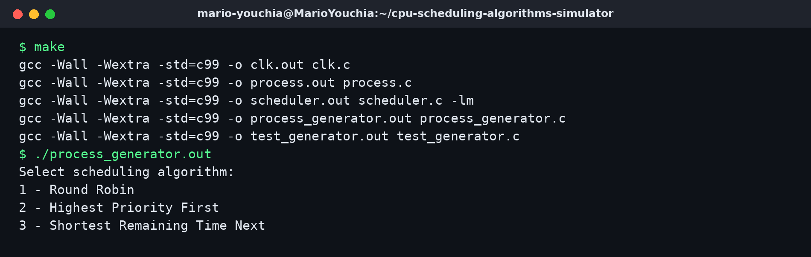
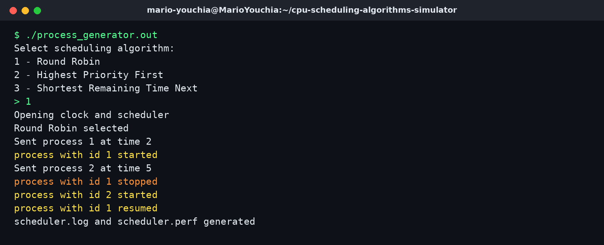
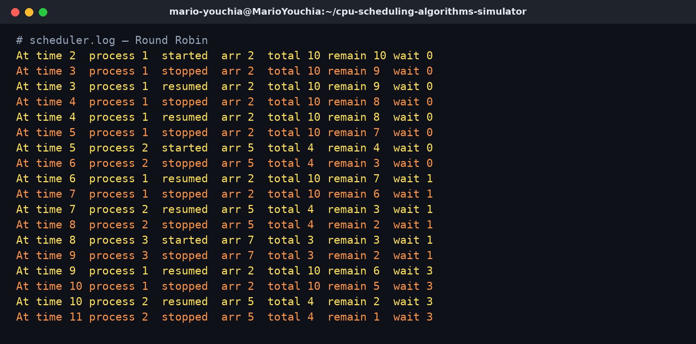
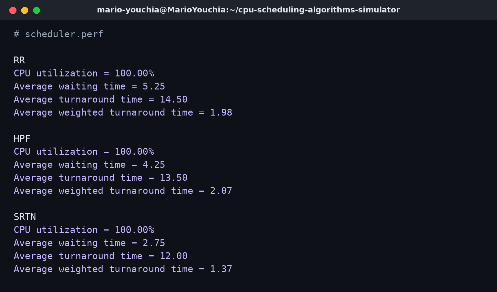
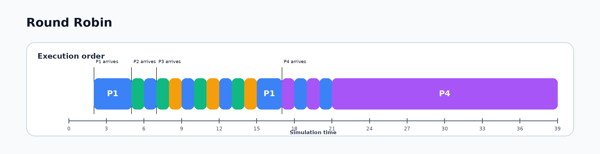

# CPU Scheduling Algorithms Simulator

CPU Scheduling Algorithms Simulator is a C-based operating-systems project that simulates process scheduling using a process generator, an emulated clock, System V IPC, and forked child processes. The scheduler supports Round Robin, Highest Priority First, and Shortest Remaining Time Next scheduling.

## Preview



The project is built from multiple C programs, including the clock, process generator, scheduler, process executable, and test generator.



The console interaction lets the user select a scheduling algorithm and starts the clock and scheduler processes.



The scheduler log records process state changes such as started, stopped, resumed, and finished.



The performance output summarizes CPU utilization, waiting time, turnaround time, and weighted turnaround time.



Round Robin gives ready processes short turns and places unfinished processes back into the ready queue.


Highest Priority First selects the highest-priority ready process according to the project priority ordering.


Shortest Remaining Time Next can preempt the running process when a process with shorter remaining time is available.

## Main Features

* C implementation of an operating-system scheduling simulation
* Round Robin scheduling
* Highest Priority First scheduling
* Shortest Remaining Time Next scheduling
* Process generator that reads `processes.txt`
* Emulated clock using shared memory
* Scheduler/process communication using System V message queues
* Forked child processes representing running jobs
* Scheduler log output through `scheduler.log`
* Performance summary output through `scheduler.perf`

## Input Process Set

The included `processes.txt` file uses the following format:

```text
#id arrival runtime priority
```

The current input process set is:

| Process | Arrival time | Runtime | Priority |
|---|---:|---:|---:|
| P1 | 2 | 10 | 2 |
| P2 | 5 | 4 | 8 |
| P3 | 7 | 3 | 4 |
| P4 | 17 | 20 | 9 |

## Algorithm Summary

| Algorithm | Main idea |
|---|---|
| Round Robin | Runs each ready process for a fixed time quantum, then returns unfinished processes to the ready queue |
| Highest Priority First | Selects the highest-priority process among the processes that have arrived |
| Shortest Remaining Time Next | Selects the process with the shortest remaining runtime and can preempt the current process |

## Metrics

| Algorithm | Average waiting | Average turnaround | Average WTA |
|---|---:|---:|---:|
| Round Robin (q = 1) | 5.25 | 14.50 | 1.98 |
| Highest Priority First | 4.25 | 13.50 | 2.07 |
| Shortest Remaining Time Next | 2.75 | 12.00 | 1.37 |

## Technical Overview

The project uses separate C programs for the clock, process generator, scheduler, process execution, and test generation.

| File | Purpose |
|---|---|
| `process_generator.c` | Reads `processes.txt`, asks for the scheduling algorithm, starts the clock and scheduler, and sends process arrivals |
| `scheduler.c` | Implements the scheduling logic and writes log/performance output |
| `process.c` | Represents a running process with a remaining runtime |
| `clk.c` | Implements an emulated simulation clock using shared memory |
| `test_generator.c` | Generates random process input files |
| `headers.h` | Shared definitions, IPC helpers, queue, and priority-queue structures |
| `processes.txt` | Input process file |

The scheduler receives arriving processes through a System V message queue and uses the shared clock to update simulation time. Each selected process is started or resumed as a forked child process. The scheduler logs process state changes and computes performance metrics after the simulation.

## How to Run / Review

Build the project on Linux:

```bash
make
```

Run the process generator:

```bash
./process_generator.out
```

Then select one of the scheduling algorithms when prompted:

```text
1 - Round Robin
2 - Highest Priority First
3 - Shortest Remaining Time Next
```

The project generates:

```text
scheduler.log
scheduler.perf
```

To remove compiled files and runtime outputs:

```bash
make clean
```

## Limitations

This is a course-level operating-systems scheduler simulation. It focuses on scheduling concepts, process coordination, and IPC-based simulation rather than being a production operating-system scheduler.
